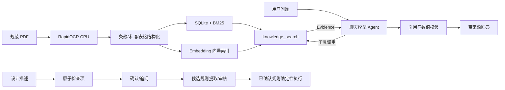

# 油气管网规范 RAG 问答与合规预审 Agent

这是一个把技术规范转换为可检索、可引用、可执行知识的 RAG 应用。输入规范 PDF 后，系统完成
OCR 与条款结构化，建立 BM25 和 Embedding 索引，并提供带条款、页码和原文证据的问答；对于
设计描述，还能拆分检查项并通过确定性规则执行合规预审。

## 一分钟了解

```text
规范 PDF → OCR/结构化 → SQLite + BM25 + Vector
                              ↓
用户问题 → 单 Agent → knowledge_search → Evidence 校验 → 带来源回答
设计描述 → 原子检查项 → 规则匹配与确定性执行 → 合规预审报告
```

项目的核心约束是“先取证，再回答”：聊天模型不能直接访问数据库，只能通过
`knowledge_search` 获取 Evidence；回答还要通过 Evidence ID、引用字段和工程数值校验。
明确条款号或表号走精确检索，开放语义问题才进入 BM25 与向量候选融合。

### 当前测试快照

当前公开结果来自自动生成并冻结的可复现测试集 `generated-v1.3.0`。知识库包含三份规范、
1092 个知识单元；向量索引 `index_e2d07010e6a742afe128` 使用
`qwen3.7-text-embedding`，包含 1092 个 1024 维向量，版本与内容一致性检查通过。

| 测试项 | 当前结果 | 结论 |
| --- | ---: | --- |
| BM25 Recall@1 / Recall@5 | 68.18% / 95.45% | Top-5 召回已达到当前冻结集目标 |
| BM25 MRR / nDCG@5 | 80.11% / 79.65% | 首位排序仍有优化空间 |
| Vector Recall@1 / Recall@5 | 43.18% / 77.27% | 连接、建库和检索链路均已实测 |
| Hybrid Recall@1 / Recall@5 | 65.91% / 86.36% | 当前融合弱于纯 BM25，未作为提升项宣传 |
| 必需工具调用召回率 | 86.67%（13/15） | 错误工具调用率为 0 |
| 工具参数、证据使用、成功率 | 100% | 无证据结论率为 0 |
| 设计拆解 Precision / Recall / F1 | 100% / 92.65% / 96.18% | Exact Match 为 84.38% |
| 候选规则抽取 | 14 个冻结案例全部通过 | 当前自动指标均为 100% |
| 端到端任务识别 / 安全降级 | 100% / 100% | 最终状态准确率因缺少可执行规则基准暂不计入 |

这些结果反映当前测试集表现，不代表对所有规范或生产场景的泛化保证。复现方式见
[评测说明](evaluation/README.md)，已知差距和处理记录见[问题与解决办法](#问题与解决办法)。

## 主要能力

- 中文规范 PDF 页面化和 CPU OCR，保留坐标、置信度、页码与原页图像。
- 条款层级、术语、图注、候选表格和知识单元结构化。
- SQLite 精确检索、BM25 和 Embedding 语义向量检索。
- 明确条款号/表号使用确定性精确查询，开放问题使用 BM25 与向量检索。
- 证据不足时记录缺口并采用保留标识符改写、领域同义词、问题拆分或路线切换重试；无新增证据即安全停止。
- 大模型调用 `knowledge_search`，仅依据工具返回的 Evidence 组织中文回答。
- Claim-Evidence 绑定、引用校验、工程数值校验和证据不足安全拒答。
- 设计描述原子拆解、状态确认、缺失条件追问与会话恢复。
- 阈值、范围、枚举、布尔、单位换算、查表和复合规则确定性执行。
- 规范 Evidence 可提取为 SQLite 持久化候选规则；确认后的版本才能进入正式规则库。
- FastAPI、SQLite 会话、响应式 Web 问答页面和 Markdown/JSON 报告。
- 检索、问答、拆解、合规四类可复现评测及版本哈希绑定。

## 架构



详细组件和安全边界见 [系统架构说明](docs/ARCHITECTURE.md)。

## 技术栈

- Python 3.12、FastAPI、Pydantic、SQLite
- RapidOCR、ONNX Runtime CPU、PyMuPDF、Pillow
- BM25、OpenAI-compatible Embeddings、FAISS CPU（可选）
- OpenAI-compatible Chat Completions、LangGraph（原生图入口可选）
- 原生 HTML/CSS/JavaScript，无 npm 构建链

## 目录结构

```text
app/
  api/             API 路由
  clarification/  条件追问与恢复
  compliance/     规则和确定性执行器
  core/           配置、模型客户端、日志和异常
  design/         设计描述拆解
  evaluation/     统一评测器
  ingestion/      PDF 与 OCR
  knowledge/      SQLite、BM25、向量索引
  qa/             RAG Agent 与回答校验
  retrieval/      查询分析和 Evidence
  web/            问答页面
  workflow/       单 Agent 状态工作流
scripts/          OCR、建库、评测和重放工具
evaluation/       固定评测集与报告
docs/             架构和补充文档
data/             本地规范、OCR、数据库和索引，不提交 Git
```

## 环境要求

推荐使用 Docker Engine 和 Docker Compose v2。默认镜像为 CPU 环境，不需要 NVIDIA GPU、CUDA 或 cuDNN；建议至少 4 CPU、8 GB 内存。本地运行要求 Python 3.12+。

## 快速启动

### 1. 准备配置与目录

```bash
cp .env.example .env
mkdir -p data/raw data/pages data/ocr data/processed data/indexes
```

将规范 PDF 放入 `data/raw/`。规范原文、OCR、数据库和向量文件均不会提交到 Git。

Linux 用户如果 UID/GID 不是 `1000`，请根据 `id -u`、`id -g` 修改 `.env` 中的 `LOCAL_UID`、`LOCAL_GID`。

### 2. 配置 RAG 模型

```dotenv
APP_MODEL__PROVIDER=compatible
APP_MODEL__CHAT_BASE_URL=https://api.deepseek.com
APP_MODEL__CHAT_API_KEY_ENV=DEEPSEEK_API_KEY
APP_MODEL__CHAT_MODEL=deepseek-v4-flash
DEEPSEEK_API_KEY=你的DeepSeek密钥
APP_MODEL__EMBEDDING_BASE_URL=https://你的Embedding服务地址/v1
APP_MODEL__EMBEDDING_API_KEY_ENV=LLM_API_KEY
APP_MODEL__EMBEDDING_MODEL=Embedding模型名称
APP_MODEL__EMBEDDING_BATCH_SIZE=16
APP_MODEL__EMBEDDING_MAX_CHARS=6000
APP_MODEL__REQUEST_RETRIES=3
APP_MODEL__API_KEY_ENV=LLM_API_KEY
LLM_API_KEY=你的密钥
APP_AGENT__RAG_LLM_ENABLED=true
APP_RETRIEVAL__CONTEXTUAL_ENABLED=true
APP_RETRIEVAL__CONTEXTUAL_STRATEGY=deterministic
APP_RETRIEVAL__CONTEXTUAL_VERSION=v1
```

`.env` 不得提交。远程建库会把知识单元发送给 Embedding 服务，问答会把检索 Evidence 发送给聊天模型，启用前应确认数据授权和服务方的数据政策。

离线后备模式可设置：

```dotenv
APP_AGENT__RAG_LLM_ENABLED=false
```

离线模式使用确定性哈希向量和抽取式回答，适合测试或故障降级，不代表完整语义 RAG 能力。

### 3. 构建与启动

```bash
docker compose build agent
docker compose up --detach agent
docker compose ps
docker compose logs --follow agent
```

访问地址：

- Web 问答：`http://127.0.0.1:8000/api/v1/demo`
- OpenAPI：`http://127.0.0.1:8000/docs`
- 健康检查：`http://127.0.0.1:8000/api/v1/health`
- 工作流图：`http://127.0.0.1:8000/api/v1/workflow/graph`

停止服务：

```bash
docker compose down
```

`data/` 通过 Volume 持久化，删除容器不会删除正式数据。

## 构建知识库

首次导入规范时依次执行。

### PDF 元数据检查

```bash
docker compose run --rm --no-deps agent \
  python scripts/ingest_pdf.py --inspect-only
```

### OCR

先进行单页检查：

```bash
docker compose run --rm --no-deps agent \
  python scripts/ingest_pdf.py --max-pages 1
```

确认正常后执行完整 OCR：

```bash
docker compose run --rm --no-deps agent \
  python scripts/ingest_pdf.py
```

OCR 支持断点缓存。只有明确需要重新生成时才增加 `--force`。

### 条款结构化

```bash
docker compose run --rm --no-deps agent \
  python scripts/build_structure.py
```

OCR 修正可参考 `corrections.example.yaml`。修订只作用于结构化副本，不覆盖原始 OCR。

### 索引构建

```bash
docker compose run --rm --no-deps agent \
  python scripts/build_index.py
```

该命令生成 SQLite、BM25、Embedding 向量、可选 FAISS 文件和索引版本清单。检查一致性：

BM25 和 Embedding 使用确定性生成的 `context_prefix + 原始 content`，引用仍只使用原始内容。构建同时生成 `data/indexes/contextual_units.jsonl` 审计文件。修改上下文策略或版本后必须重新运行本命令；配置变化会触发全量上下文重算。

```bash
docker compose run --rm --no-deps agent \
  python scripts/build_index.py --check
```

数据库知识单元、BM25 文档、向量 ID 和向量数量必须一致。

## 使用问答 Agent

Web 首页以问答为主视图，证据、检查项、合规结果和运行 Trace 默认收在可展开侧栏。

直接调用 API：

```bash
curl -X POST http://127.0.0.1:8000/api/v1/qa \
  -H 'Content-Type: application/json' \
  -d '{
    "question": "Q/GGW 02005.2-2022 第8.3.4.4条有什么安装要求？",
    "top_k": 5
  }'
```

响应包含：

- `answer_text`：模型组织的回答，末尾固定附证据来源；
- `claims`：逐条结论及绑定的 `evidence_ids`；
- `citations`：规范号、条款/表号、页码和原文摘录；
- `tool_calls`：模型实际调用 `knowledge_search` 的查询和结果数；
- `limitations`：证据不足、模型降级或人工复核说明；
- `trace`：检索路线和候选结果。

明确编号查询采用确定性精确检索，开放问题才使用 BM25 与语义向量，避免相似内容冒充指定条款。模型输出必须通过结构化 Schema、Evidence ID、引用和数值校验；失败时系统明确降级或拒答，不使用模型记忆补写规范。

## 设计描述与合规预审

设计描述预览：

```bash
curl -X POST http://127.0.0.1:8000/api/v1/design/preview \
  -H 'Content-Type: application/json' \
  -d '{"description":"新建输气站控制室照度为500lx，UPS持续供电时间为2h。"}'
```

系统将描述拆成原子检查项，保留原文、字符位置、显式字段、推断字段和不确定性。检查项确认后进入规则匹配，缺少条件时进入合并追问。

合规执行接口：

```text
POST /api/v1/compliance/evaluate
```

最终判断由确定性执行器完成，不由聊天模型直接决定。支持数值阈值、范围、单位换算、枚举、布尔、唯一查表和 AND/OR 复合规则。

候选规则审核接口：

```text
POST /api/v1/candidate-rules/extract
GET  /api/v1/candidate-rules
GET  /api/v1/candidate-rules/{candidate_rule_id}
POST /api/v1/candidate-rules/{candidate_rule_id}/confirm
POST /api/v1/candidate-rules/{candidate_rule_id}/reject
POST /api/v1/candidate-rules/{candidate_rule_id}/revise
GET  /api/v1/rules
GET  /api/v1/rules/{rule_id}
```

候选规则默认 `pending_review`，确认过程会保存原始 JSON、修改后版本、操作信息和备注。`rejected` 规则不会进入正式规则库；匹配存在缺条件、歧义或冲突时不会执行确定性判断。

外部标准、缺失条件、未解析表格和非唯一查表不会输出确定性结论。

## 会话与证据接口

```text
POST /api/v1/sessions
POST /api/v1/sessions/{session_id}/messages
POST /api/v1/sessions/{session_id}/confirm
POST /api/v1/sessions/{session_id}/clarify
GET  /api/v1/sessions/{session_id}
POST /api/v1/sessions/{session_id}/replay
GET  /api/v1/sessions/{session_id}/report?format=markdown|json

GET /api/v1/knowledge/documents
GET /api/v1/knowledge/index-versions
GET /api/v1/knowledge/status
GET /api/v1/pages/{document_id}/{page_number}
```

消息接口使用 `idempotency_key` 防止重复提交。恢复令牌只在 SQLite 保存哈希，原页接口只允许访问已登记文档和页码。

## 复现评测

```bash
docker compose run --rm --no-deps agent \
  python scripts/run_evaluation.py

docker compose run --rm --no-deps agent \
  python scripts/run_demo_cases.py
```

输出位于本地 `evaluation/reports/latest/`，包括 JSON、Markdown、HTML 指标报告和演示结果。
评测记录代码哈希、索引版本、Embedding/Chat 模型、运行配置和数据集 SHA256，便于确认两次结果是否
在同一版本上产生。公开仓库只保留评测框架、清单和聚合结果，不提交规范原文、生成样本、失败案例
明细或查询向量缓存。

## 问题与解决办法

### 1. BM25 Recall@5 偏低

初次生成冻结测试集时，BM25 Recall@5 仅为 31.82%。逐案展开全部 1092 个候选后确认，
黄金单元均有 BM25 分数，没有因过滤、SQLite 内容缺失或 OCR 错误而完全丢失；主要问题是
排序和评测标签质量：

- 中文原先按单字切分，高频单字累加后压过工程实体和属性短语；
- 自动问题包含“该设备、这一事项、该术语”等无信息占位词；
- 旧评测没有复用 `QueryAnalyzer` 生成的标准号和知识单元类型过滤；
- 同一条款可能同时存在 `CLAUSE` 和 `TERM` 单元，生成器曾误标黄金单元类型；
- 多条款问题只包含编号，没有包含两个来源条款的真实主题。

解决办法：

- 中文索引改用连续二元词组，英文、数字和条款号仍保留完整词元；
- BM25 查询词元去重，避免通用词重复加权；
- 自动问题从真实条款抽取对象和属性主题，并对三份规范交错分层取样；
- 评测复用真实查询分析过滤，精确条款黄金标签强制限定为 `CLAUSE`；
- 冻结集经过设计与规则覆盖修订后显式升级至 `generated-v1.3.0`，并更新全部 SHA256。

修复后的 frozen 指标为 Recall@1 68.18%、Recall@5 95.45%、MRR 80.11%、nDCG@5
79.65%，多目标 Top-5 完整覆盖率 79.55%。剩余问题主要是超长父章节知识单元的切分粒度，
以及明确表号在纯 BM25 路线中的排序；生产工作流对明确条款号和表号使用 `exact` 路线。

### 2. 向量模型可调用，但索引版本可能不一致

仅成功请求 Embedding API，不能证明磁盘索引由同一模型、配置和知识内容生成。旧实现缺少强绑定，
配置变化后可能继续加载不兼容向量。

解决办法：索引 manifest 记录模型 ID、脱敏配置指纹、向量维度、知识单元源哈希和 contextual
strategy 哈希；加载时同时校验当前配置、manifest 和向量文件实际维度。当前索引包含 1092 个
1024 维向量，一致性检查通过。

### 3. Hybrid 召回低于 BM25

同一冻结集上，Vector Recall@5 为 77.27%，Hybrid Recall@5 为 86.36%，均低于 BM25 的
95.45%。这说明连接问题已经排除，但语义候选质量和融合排序仍需优化。

解决办法：RRF 权重只在 dev 集调优，避免使用 frozen test 选参数。当前最佳非零向量权重为
BM25 `1.0`、Vector `0.25`，但仍未超过纯 BM25，因此保留测量结果，不把混合检索描述为收益。
失败样本主要是明确条款号和表号；生产流程已将这类问题交给 `exact` 路线，语义改写继续由
Vector/Hybrid 处理。

### 4. 长时间评测中的 Embedding 请求不稳定

批量评测可能遇到远程服务瞬时超时或重复计算查询向量，导致整轮评测耗时增加。

解决办法：模型客户端增加有限重试；评测使用本地查询向量缓存恢复运行。缓存只属于运行产物，
已通过 `.gitignore` 排除，不进入公开仓库。

## 本地开发

```bash
python -m venv .venv
source .venv/bin/activate
python -m pip install -e '.[dev,ocr,index,agent]'
cp .env.example .env
python -m app.main
```

代码检查：

```bash
ruff format --check .
ruff check .
mypy app
pytest
```

## 数据与安全边界

- `.env`、规范 PDF、OCR、页面图像、SQLite 和向量索引默认不提交 Git。
- 远程模型只应在得到规范数据外传授权后启用。
- 回答只在已导入规范范围内提供证据，不替代正式工程审查。
- 复杂表格可能标记为 `NEEDS_MANUAL_ANNOTATION`，不得自动查值。
- 模型不能直接决定最终合规状态，最终判断由确定性执行器完成。
- 没有充分证据时必须拒答、返回部分结果或标记待复核。
