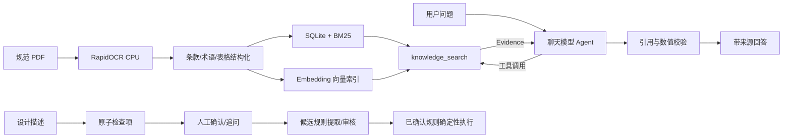

# 油气管网规范 RAG 问答与合规预审 Agent

本项目面向油气管网仪表与自动控制技术规范，提供从 PDF/OCR、条款结构化、语义向量建库，到 RAG 问答、设计描述拆解和确定性合规预审的一体化能力。

系统采用单 Agent 工作流。聊天模型不能直接访问数据库，而是通过 `knowledge_search` 工具获取规范证据，再依据 Evidence 组织回答。充分回答必须通过 Evidence ID、引用字段和数值一致性校验，并在末尾标注规范、条款和页码来源。

## 主要能力

- 中文规范 PDF 页面化和 CPU OCR，保留坐标、置信度、页码与原页图像。
- 条款层级、术语、图注、候选表格和知识单元结构化。
- SQLite 精确检索、BM25 和 Embedding 语义向量检索。
- 明确条款号/表号使用确定性精确查询，开放问题使用 BM25 与向量检索。
- 证据不足时记录缺口并采用保留标识符改写、领域同义词、问题拆分或路线切换重试；无新增证据即安全停止。
- 大模型调用 `knowledge_search`，仅依据工具返回的 Evidence 组织中文回答。
- Claim-Evidence 绑定、引用校验、工程数值校验和证据不足安全拒答。
- 设计描述原子拆解、人工确认、缺失条件追问与会话恢复。
- 阈值、范围、枚举、布尔、单位换算、查表和复合规则确定性执行。
- 规范 Evidence 可提取为 SQLite 持久化候选规则；只有人工确认版本能进入正式规则库。
- FastAPI、SQLite 会话、响应式 Web 问答页面和 Markdown/JSON 报告。
- 检索、问答、拆解、合规四类可复现评测及版本哈希绑定。

## 架构



详细组件和安全边界见 [系统架构说明](docs/ARCHITECTURE.md)。

## 技术栈

- Python 3.12、FastAPI、Pydantic、SQLite
- RapidOCR、ONNX Runtime CPU、PyMuPDF、Pillow
- BM25、OpenAI-compatible Embeddings、FAISS CPU（可选）
- OpenAI-compatible Chat Completions、LangGraph（原生图入口可选）
- 原生 HTML/CSS/JavaScript，无 npm 构建链

## 目录结构

```text
app/
  api/             API 路由
  clarification/  条件追问与恢复
  compliance/     规则和确定性执行器
  core/           配置、模型客户端、日志和异常
  design/         设计描述拆解
  evaluation/     统一评测器
  ingestion/      PDF 与 OCR
  knowledge/      SQLite、BM25、向量索引
  qa/             RAG Agent 与回答校验
  retrieval/      查询分析和 Evidence
  web/            问答页面
  workflow/       单 Agent 状态工作流
scripts/          OCR、建库、评测和重放工具
evaluation/       固定评测集与报告
docs/             架构和补充文档
data/             本地规范、OCR、数据库和索引，不提交 Git
```

## 环境要求

推荐使用 Docker Engine 和 Docker Compose v2。默认镜像为 CPU 环境，不需要 NVIDIA GPU、CUDA 或 cuDNN；建议至少 4 CPU、8 GB 内存。本地运行要求 Python 3.12+。

## 快速启动

### 1. 准备配置与目录

```bash
cp .env.example .env
mkdir -p data/raw data/pages data/ocr data/processed data/indexes
```

将规范 PDF 放入 `data/raw/`。规范原文、OCR、数据库和向量文件均不会提交到 Git。

Linux 用户如果 UID/GID 不是 `1000`，请根据 `id -u`、`id -g` 修改 `.env` 中的 `LOCAL_UID`、`LOCAL_GID`。

### 2. 配置 RAG 模型

```dotenv
APP_MODEL__PROVIDER=compatible
APP_MODEL__BASE_URL=https://你的服务地址/v1
APP_MODEL__CHAT_MODEL=聊天模型名称
APP_MODEL__EMBEDDING_MODEL=Embedding模型名称
APP_MODEL__EMBEDDING_BATCH_SIZE=16
APP_MODEL__EMBEDDING_MAX_CHARS=6000
APP_MODEL__REQUEST_RETRIES=3
APP_MODEL__API_KEY_ENV=LLM_API_KEY
LLM_API_KEY=你的密钥
APP_AGENT__RAG_LLM_ENABLED=true
```

`.env` 不得提交。远程建库会把知识单元发送给 Embedding 服务，问答会把检索 Evidence 发送给聊天模型，启用前应确认数据授权和服务方的数据政策。

离线后备模式可设置：

```dotenv
APP_AGENT__RAG_LLM_ENABLED=false
```

离线模式使用确定性哈希向量和抽取式回答，适合测试或故障降级，不代表完整语义 RAG 能力。

### 3. 构建与启动

```bash
docker compose build agent
docker compose up --detach agent
docker compose ps
docker compose logs --follow agent
```

访问地址：

- Web 问答：`http://127.0.0.1:8000/api/v1/demo`
- OpenAPI：`http://127.0.0.1:8000/docs`
- 健康检查：`http://127.0.0.1:8000/api/v1/health`
- 工作流图：`http://127.0.0.1:8000/api/v1/workflow/graph`

停止服务：

```bash
docker compose down
```

`data/` 通过 Volume 持久化，删除容器不会删除正式数据。

## 构建知识库

首次导入规范时依次执行。

### PDF 元数据检查

```bash
docker compose run --rm --no-deps agent \
  python scripts/ingest_pdf.py --inspect-only
```

### OCR

先进行单页检查：

```bash
docker compose run --rm --no-deps agent \
  python scripts/ingest_pdf.py --max-pages 1
```

确认正常后执行完整 OCR：

```bash
docker compose run --rm --no-deps agent \
  python scripts/ingest_pdf.py
```

OCR 支持断点缓存。只有明确需要重新生成时才增加 `--force`。

### 条款结构化

```bash
docker compose run --rm --no-deps agent \
  python scripts/build_structure.py
```

人工 OCR 修正可参考 `corrections.example.yaml`。修订只作用于结构化副本，不覆盖原始 OCR。

### 索引构建

```bash
docker compose run --rm --no-deps agent \
  python scripts/build_index.py
```

该命令生成 SQLite、BM25、Embedding 向量、可选 FAISS 文件和索引版本清单。检查一致性：

```bash
docker compose run --rm --no-deps agent \
  python scripts/build_index.py --check
```

数据库知识单元、BM25 文档、向量 ID 和向量数量必须一致。

## 使用问答 Agent

Web 首页以问答为主视图，证据、检查项、合规结果和运行 Trace 默认收在可展开侧栏。

直接调用 API：

```bash
curl -X POST http://127.0.0.1:8000/api/v1/qa \
  -H 'Content-Type: application/json' \
  -d '{
    "question": "Q/GGW 02005.2-2022 第8.3.4.4条有什么安装要求？",
    "top_k": 5
  }'
```

响应包含：

- `answer_text`：模型组织的回答，末尾固定附证据来源；
- `claims`：逐条结论及绑定的 `evidence_ids`；
- `citations`：规范号、条款/表号、页码和原文摘录；
- `tool_calls`：模型实际调用 `knowledge_search` 的查询和结果数；
- `limitations`：证据不足、模型降级或人工复核说明；
- `trace`：检索路线和候选结果。

明确编号查询采用确定性精确检索，开放问题才使用 BM25 与语义向量，避免相似内容冒充指定条款。模型输出必须通过结构化 Schema、Evidence ID、引用和数值校验；失败时系统明确降级或拒答，不使用模型记忆补写规范。

## 设计描述与合规预审

设计描述预览：

```bash
curl -X POST http://127.0.0.1:8000/api/v1/design/preview \
  -H 'Content-Type: application/json' \
  -d '{"description":"新建输气站控制室照度为500lx，UPS持续供电时间为2h。"}'
```

系统将描述拆成原子检查项，保留原文、字符位置、显式字段、推断字段和不确定性。检查项需要人工确认，缺少条件时进入合并追问。

合规执行接口：

```text
POST /api/v1/compliance/evaluate
```

最终判断由确定性执行器完成，不由聊天模型直接决定。支持数值阈值、范围、单位换算、枚举、布尔、唯一查表、AND/OR 复合规则和人工复核规则。

候选规则审核接口：

```text
POST /api/v1/candidate-rules/extract
GET  /api/v1/candidate-rules
GET  /api/v1/candidate-rules/{candidate_rule_id}
POST /api/v1/candidate-rules/{candidate_rule_id}/confirm
POST /api/v1/candidate-rules/{candidate_rule_id}/reject
POST /api/v1/candidate-rules/{candidate_rule_id}/revise
GET  /api/v1/rules
GET  /api/v1/rules/{rule_id}
```

候选规则默认 `pending_review`，审核会保存原始 JSON、修改后版本、审核人、时间和备注。`rejected` 规则不会进入正式规则库；匹配存在缺条件、歧义或冲突时不会执行确定性判断。

外部标准、缺失条件、未解析表格和非唯一查表不会输出确定性结论。

## 会话与证据接口

```text
POST /api/v1/sessions
POST /api/v1/sessions/{session_id}/messages
POST /api/v1/sessions/{session_id}/confirm
POST /api/v1/sessions/{session_id}/clarify
GET  /api/v1/sessions/{session_id}
POST /api/v1/sessions/{session_id}/replay
GET  /api/v1/sessions/{session_id}/report?format=markdown|json

GET /api/v1/knowledge/documents
GET /api/v1/knowledge/index-versions
GET /api/v1/knowledge/status
GET /api/v1/pages/{document_id}/{page_number}
```

消息接口使用 `idempotency_key` 防止重复提交。恢复令牌只在 SQLite 保存哈希，原页接口只允许访问已登记文档和页码。

## 评测

```bash
docker compose run --rm --no-deps agent \
  python scripts/run_evaluation.py

docker compose run --rm --no-deps agent \
  python scripts/run_demo_cases.py
```

输出位于 `evaluation/reports/latest/`，包括 JSON、Markdown、HTML 指标报告和三类演示结果。评测绑定代码哈希、索引版本、Embedding/Chat 模型、运行配置和数据集 SHA256。

原固定数据集继续保留，并新增开放语义检索、对抗问答、多检查项工程案例和候选规则抽取集。报告分别展示 BM25、Vector、混合与自适应检索；未填写专家评分时自由文本语义指标明确为 `NOT_EVALUATED`。所有新增案例均为非敏感合成或测试索引释义，不能外推为生产准确率。

## 本地开发

```bash
python -m venv .venv
source .venv/bin/activate
python -m pip install -e '.[dev,ocr,index,agent]'
cp .env.example .env
python -m app.main
```

代码检查：

```bash
ruff format --check .
ruff check .
mypy app
pytest
```

## 数据与安全边界

- `.env`、规范 PDF、OCR、页面图像、SQLite 和向量索引默认不提交 Git。
- 远程模型只应在得到规范数据外传授权后启用。
- 回答只在已导入规范范围内提供证据，不替代正式工程审查。
- 复杂表格可能标记为 `NEEDS_MANUAL_ANNOTATION`，不得自动查值。
- 模型不能直接决定最终合规状态，最终判断由确定性执行器完成。
- 没有充分证据时必须拒答、返回部分结果或要求人工复核。
