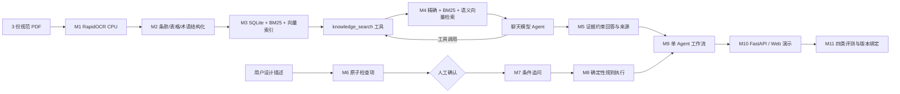

# 系统架构与安全边界

核心安全边界：问答模型必须通过 `knowledge_search` 获取规范 Evidence，生成的每条 claim 必须绑定工具返回的 `evidence_id`，引用详情由代码补齐并验证。模型（如启用）只生成经 Pydantic 校验的候选结构，最终数值、枚举、布尔和表格判断由确定性执行器完成。未解析表格、外部标准、缺失条件和未确认规则均安全降级，不输出确定性合规结论。

运行态状态存入 SQLite；恢复令牌只存哈希。原页接口只能使用已登记的 `document_id` 与页码定位。日志和 M11 版本绑定不保存 API Key。
