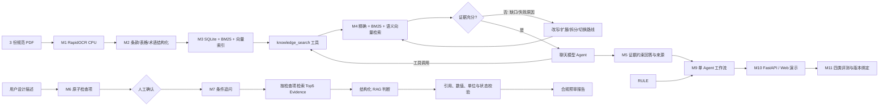

# 系统架构与安全边界

核心安全边界：问答模型必须通过 `knowledge_search` 获取规范 Evidence，生成的每条 claim 必须绑定工具返回的 `evidence_id`。合规判断模型只能消费当前 CheckItem 绑定的 Top5 直接 Evidence，输出必须符合 Pydantic Schema；代码再验证 Evidence 归属、条款/表号、实际值来源，并重新执行数值、单位、枚举和布尔比较。未解析表格、冲突证据、外部标准和缺失条件均安全降级。

自适应检索由 `plan_retrieval`、`retrieve`、`evaluate_evidence` 三个职责独立的节点组成。状态持久化原始/当前/历史查询、路线、过滤条件、候选数、新增 Evidence 数和结构化充分性评估。明确条款号或表号始终只以 exact 命中作为目标证据，邻近上下文不能替代目标。

规范问答使用独立但语义一致的受控循环：`analyze_question` 将复杂问题拆成可验证目标，`plan_qa_retrieval` 根据未覆盖目标规划最多三轮、每轮最多五个查询，`evaluate_qa_evidence` 逐目标记录 `SUPPORTED`、`PARTIAL`、`UNSUPPORTED` 或 `CONFLICT`。只有全部目标充分时才进入 `generate_qa_answer`；精确编号未命中、未解析表格、冲突证据、无新增 Evidence 或达到轮次上限均安全停止。回答生成器只消费工作流已批准的 Evidence，不自行检索。

候选规则与审核记录仍使用增量 `CREATE TABLE IF NOT EXISTS` 迁移写入现有 SQLite 文件，作为独立管理和后验复核能力，不再是合规主工作流的前置依赖。

运行态状态存入 SQLite；恢复令牌只存哈希。原页接口只能使用已登记的 `document_id` 与页码定位。日志和 M11 版本绑定不保存 API Key。
